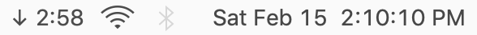
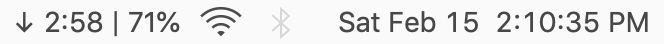
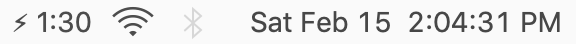
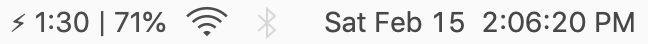

# BatteryEstimate
Brings back the estimated battery time remaining to the menu bar for MacOS / OS X

### Download
Download and install latest version from [here](https://github.com/NafeeJ/BatteryEstimate/releases)

*IMPORTANT*: If you get a warning that BatteryEstimate can't be opened due to an unidentified developer go to: "System Preferences" > "Security & Privacy" > "General" and make sure "Allow apps downloaded from:" is set to "App Store and identified developers". Then try again to open BatteryEstimate and under "System Preferences" > "Security & Privacy" > "General" click on "Open Anyway". You may have to do this for both opening the .dmg file and opening the app once it is in your Applications folder.

### Draining

  

  

### Charging

  

  

### Features
* Shows battery time remaining when unplugged
* Shows time until fully charged when plugged in
* Can toggle displaying battery percent
* Symbols to represent power state

### Notices
* Drain estimate is derived directly from the MacOS API which I guess is calculated based off of the rate at which the computer is currently draining battery and is subject to fluctuation based on its workload, so take the estimate with a grain of salt and consider the work that your computer is doing and if it is accurate or not to your average workload.
* Charge estimate is also derived directly from the MacOS API which I guess is calculated based off of the rate of charge coming into the battery.
* "Seconds Between Status Refresh" is the time between the code gets executed to update the status data so smaller intervals will use more energy over time

### Thanks
* https://github.com/iglance/iGlance for development reference
* https://github.com/sindresorhus/LaunchAtLogin for launch at login functionality
* https://github.com/LinusU/node-appdmg for making the dmg
* https://github.com/hholtmann/smcFanControl for multiline status reference

  

